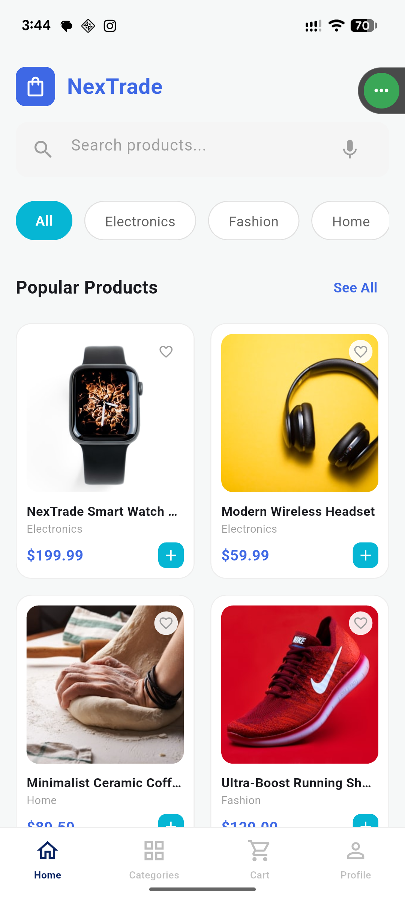
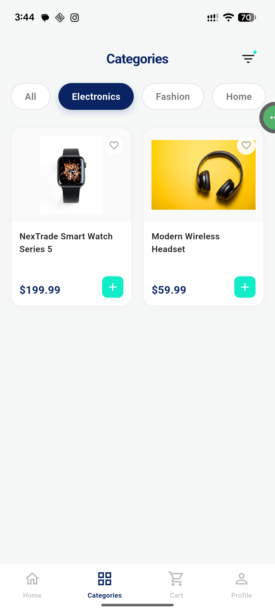
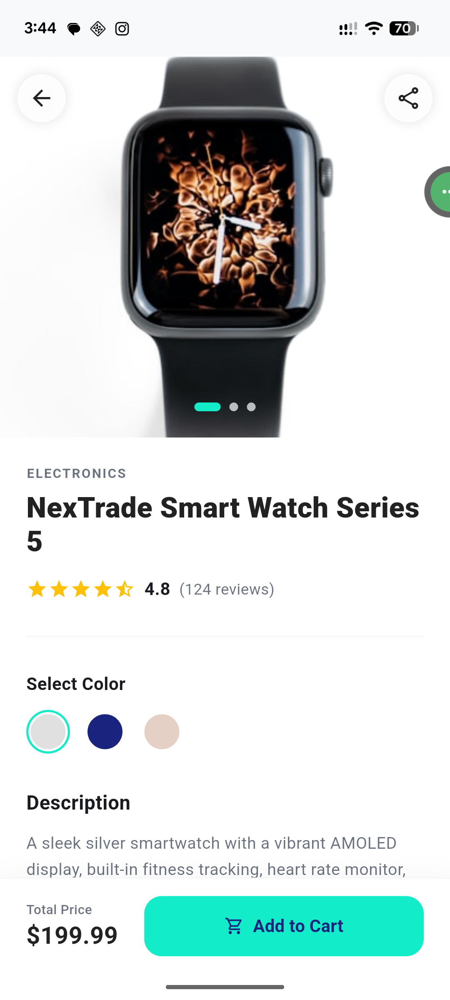
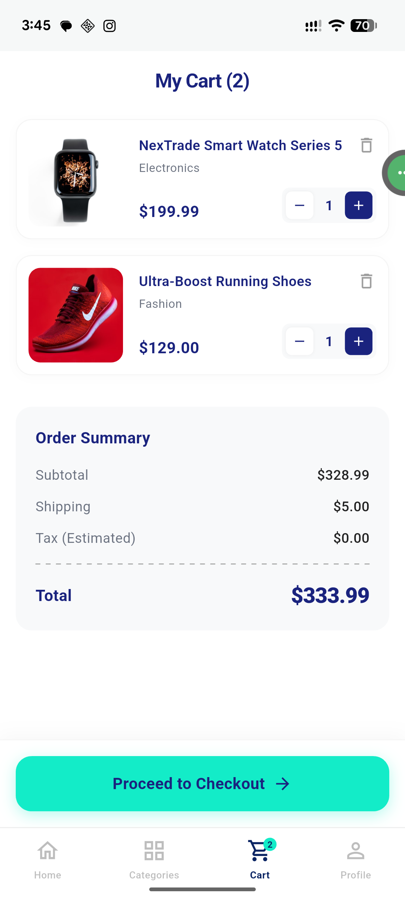

# 🛒 NexTrade - Modern E-Commerce App

A high-performance, responsive e-commerce application built with **Flutter**. NexTrade demonstrates industry-standard mobile development practices, featuring a highly scalable **Feature-First Clean Architecture**, robust state management, and a premium UI/UX design.


---

## ✨ Key Features

* **Dynamic State Management:** Global cart state managed seamlessly with Riverpod, allowing real-time quantity and price calculations across all screens.
* **Smooth Animations:** Implemented Flutter `Hero` widgets for seamless, 60fps image transitions between the grid layout and full-screen product details.
* **Category Filtering:** Dynamic list filtering without unnecessary network calls or UI jank.
* **Premium UI/UX:** Custom-built sticky bottom action bars, custom navigation, and a modern Royal Blue & Teal color palette translated flawlessly from Tailwind CSS prototypes.
* **Type-Safe Data Models:** Utilizing `freezed` and `json_serializable` for immutable, crash-resistant data parsing.

---

## 🏗️ Architecture & Tech Stack

This project strictly adheres to **Feature-First Clean Architecture** to ensure the codebase remains maintainable and scalable as the application grows.

### Directory Structure
```text
lib/
├── core/               # Shared utilities, themes, and networking components
├── features/
│   ├── cart/           # Cart logic, state providers, and UI screens
│   └── shop/           # Product fetching, domain models, and product screens
└── main.dart           # App entry point
```
### Core Technologies

*   [**Flutter Riverpod**](https://www.google.com/search?q=https://riverpod.dev/)**:** Chosen for predictable, compile-safe, and highly testable state management.
    
*   [**Freezed**](https://pub.dev/packages/freezed)**:** Used for generating robust data classes, ensuring immutability and exhaustive pattern matching.
    
*   **JSON Serialization:** Safe backend-to-frontend data mapping using json\_annotation.
    

## 📸 Screen Previews

| Home Screen | Categories Filter | Product Details | Cart & Checkout |
| :---: | :---: | :---: | :---: |
|  |  |  |  |

🚀 Getting Started
------------------

To run this project locally, ensure you have Flutter installed and your environment set up.

### Prerequisites

*   Flutter SDK (3.10.0 or higher)
    
*   Dart SDK (3.0.0 or higher)
    

### Installation
1. Clone the repository:
   ```bash
   git clone [https://github.com/YourUsername/nextrade.git](https://github.com/YourUsername/nextrade.git)

Navigate to the project directory:

```bash
cd nextrade
```
Install dependencies:

```bash
flutter pub get
```
Run the code generator (Required for Freezed models):

```bash
dart run build_runner build --delete-conflicting-outputs
```
Run the app:

```bash
flutter run
```
